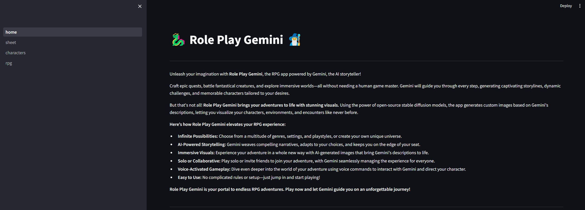
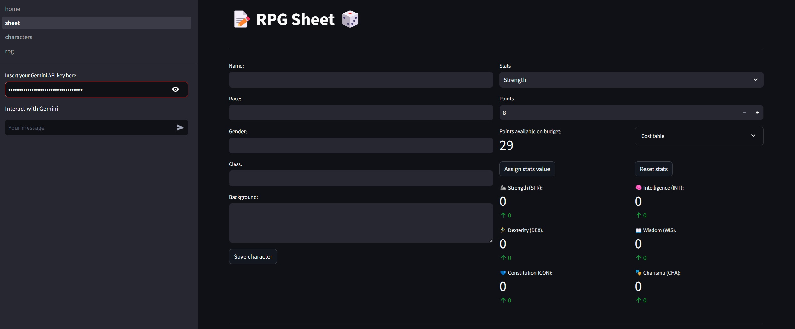
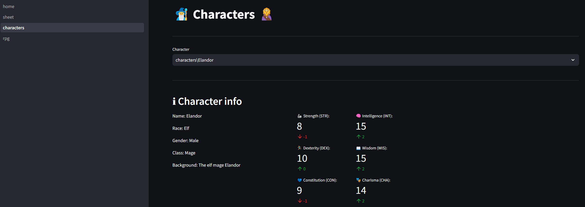
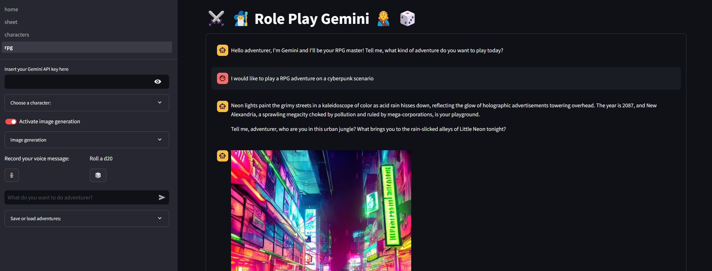

# RPG LLM


## Description

This project has the goal of create a LLM model specialized to be a RPG master, with that we desired that anyone could play a RPG adventure interacting with the LLM model through the chat and also improve the immersion in the adventure using a stable diffusion to generate images of what LLM model describe during the interactions via chat. Besides that, we could not to forget to add a d20 to give us a chance to have a critical success or a critical failure in our actions.  

## How to install

* Step 1: Clone this repository
```bash
git clone https://github.com/jvscursulim/rpg-llm
```

* Step 2: Install miniconda (https://docs.anaconda.com/free/miniconda/index.html)

* Step 3: Create env with miniconda with python 3.9
```bash
conda create -n env
```

* Step 4: Activate your new python environment
```bash
conda activate env
```

If you don't have a NVIDIA GPU you can skip the step 5.
* Step 5 (For NVIDIA GPU users): Install CUDA 11.8 using miniconda
```bash
conda install -c conda-forge cudatoolkit==11.8.0
```

```bash
conda install -c conda-forge cudnn==8.9.7.29
```

* Step 6: Install project dependencies
```bash
pip install pipenv
```

```bash
pipenv install
```
Observation: If you don't have a NVIDIA GPU, you will need to install Pytorch for CPU.

## How to use

* Step 1: Activate your python environment where you installed the project dependencies and access the folder where you find `home.py` file and run the following command 
```bash
streamlit run home.py
```
After this you will be redirected to a new tab on your browser where you will be able to interact with the RPG GPT.







